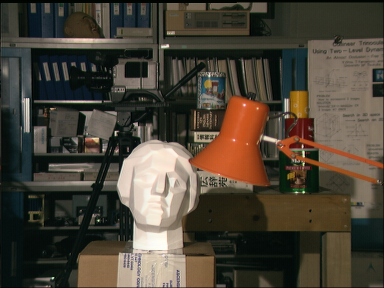
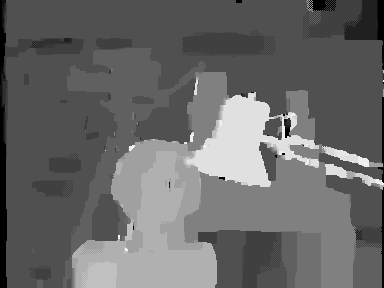

# Stereo Matching using Belief Propagation (Synchronous)

> **Repository Moved**  
> This project has been merged into [Stereo Matching Algorithms in MATLAB and Python](https://github.com/aposb/stereo-matching-algorithms).  
> The new repository contains the latest code, documentation, and updates.

An optimized (very fast) Matlab implementation of Loopy Belief Propagation for stereo matching. It uses the "Min-Sum" version of the algorithm and the "Synchronous" message update schedule.

For a different aproach, look at here: https://github.com/aposb/stereo-matching-using-belief-propagation-fast

## Input Image
The Tsukuba stereo image that used as input.

   

## Output Image
The disparity map that created at the output.

   

